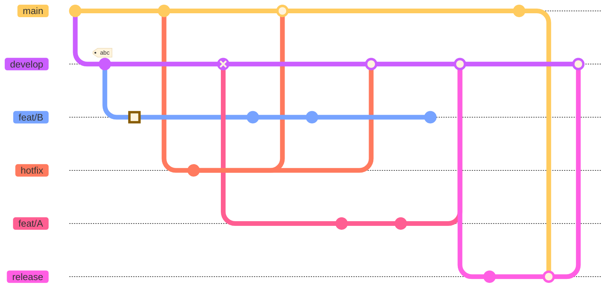

# 🤝 COLLABORATION GUIDE

Selamat datang di organisasi ini! 🎉  

Repository ini berfungsi sebagai panduan utama bagi semua **kontributor dan kolaborator** dalam mengerjakan proyek di organisasi ini.  

Panduan ini dirancang agar kamu bisa berkontribusi dengan cara yang **teratur**, **profesional**, dan **mudah dipahami**, bahkan jika kamu **baru pertama kali** menggunakan Git dan GitHub.


---

## 📚 Daftar Isi

- [🤝 COLLABORATION GUIDE](#-collaboration-guide)
  - [📚 Daftar Isi](#-daftar-isi)
  - [💡 Konsep Dasar Kolaborasi di GitHub](#-konsep-dasar-kolaborasi-di-github)
  - [🌱 Branching Strategy (Strategi Cabang)](#-branching-strategy-strategi-cabang)
    - [🧭 Diagram Alur Git Flow](#-diagram-alur-git-flow)
    - [Struktur Utama](#struktur-utama)
    - [Contoh Alur Singkat](#contoh-alur-singkat)
  - [🧩 Penamaan Branch](#-penamaan-branch)
    - [Jenis branch](#jenis-branch)
  - [🧾 Format Commit Message](#-format-commit-message)
    - [Format Umum](#format-umum)
    - [Contoh](#contoh)
    - [Jenis-jenis commit](#jenis-jenis-commit)
  - [🔄 Alur Pull Request (PR) Workflow](#-alur-pull-request-pr-workflow)
    - [💻 Diagram Alur PR](#-diagram-alur-pr)
    - [Langkah-langkah](#langkah-langkah)
  - [💬 Tips Tambahan](#-tips-tambahan)
  - [📖 Sumber Referensi](#-sumber-referensi)

---

## 💡 Konsep Dasar Kolaborasi di GitHub

Git dan GitHub memungkinkan banyak orang bekerja bersama dalam satu proyek tanpa mengacaukan kode satu sama lain.

**Istilah penting:**

- **Repository (repo):** Tempat penyimpanan kode dan riwayat perubahan.
- **Branch:** Cabang pengembangan terpisah dari kode utama (`main` atau `develop`).
- **Commit:** Catatan perubahan kode dengan pesan deskriptif.
- **Pull Request (PR):** Permintaan untuk menggabungkan branch ke branch lain (biasanya `develop` atau `main`).
- **Merge:** Menggabungkan hasil kerja dari satu branch ke branch utama.

> 🎯 Tujuan kita: Setiap kontributor memiliki alur kerja yang seragam, sehingga kolaborasi menjadi efisien dan mudah dikelola.

---

## 🌱 Branching Strategy (Strategi Cabang)

Kita menggunakan **Git Flow Model** ([referensi](https://nvie.com/posts/a-successful-git-branching-model/))  

Strategi ini menjaga kode tetap stabil di `main`, sementara pengembangan aktif dilakukan di `develop`.

### 🧭 Diagram Alur Git Flow




### Struktur Utama

| Branch | Fungsi | Catatan |
|--------|---------|---------|
| `main` | Kode versi stabil/production | Hanya di-update dari `release` |
| `develop` | Tempat integrasi semua fitur | Semua feat branch di-merge ke sini |
| `feat/*` | Pengembangan fitur baru | Dibuat dari `develop` |
| `bugfix/*` | Perbaikan bug minor | Dibuat dari `develop` |
| `hotfix/*` | Perbaikan cepat di production | Dibuat dari `main`, nanti merge ke `main` dan `develop` |
| `release/*` | Persiapan rilis versi baru | Dibuat dari `develop`, lalu merge ke `main` & `develop` |

> 💡 Semua branch fitur atau bug harus di-*merge* ke `develop`, bukan langsung ke `main`.

### Contoh Alur Singkat

1. Buat branch baru dari `develop` → `feat/login-page`
2. Lakukan commit perubahan di branch tersebut
3. Setelah selesai, buat Pull Request (PR) ke `develop`
4. Setelah direview dan disetujui, branch akan di-merge

> 📘 Referensi lengkap: [Git Flow Branching Strategy (Gist by Seunggabi)](https://gist.github.com/seunggabi/87f8c722d35cd07deb3f649d45a31082)

---

## 🧩 Penamaan Branch

Gunakan format berikut agar branch mudah dipahami oleh tim lain.  
Referensi: [Naming Conventions Cheat Sheet](https://medium.com/@abhay.pixolo/naming-conventions-for-git-branches-a-cheatsheet-8549feca2534)

```bash
<type>/<short-description>
```

### Jenis branch

| Tipe | Contoh | Deskripsi |
|------|---------|-----------|
| `feat/` | `feat/add-user-auth` | Fitur baru |
| `bugfix/` | `bugfix/fix-login-error` | Perbaikan bug minor |
| `hotfix/` | `hotfix/fix-server-crash` | Perbaikan darurat di produksi |
| `release/` | `release/v1.2.0` | Persiapan rilis versi tertentu |
| `docs/` | `docs/update-readme` | Update dokumentasi |
| `test/` | `test/add-unit-tests` | Penambahan atau update testing |

> Gunakan **huruf kecil semua** dan **dash (-)** untuk memisahkan kata.

---

## 🧾 Format Commit Message

Kita menggunakan **[Conventional Commits](https://www.conventionalcommits.org/id/v1.0.0/)** sebagai standar penulisan pesan commit.  
Hal ini membantu kita menjaga riwayat proyek tetap bersih, mudah dibaca, dan kompatibel dengan tool otomatis seperti changelog generator.

### Format Umum

```sh
<type>(optional scope): <short summary>
```

### Contoh

```bash
feat(auth): add login API endpoint
fix(ui): resolve button alignment issue
docs(readme): update contribution guide
refactor(user): simplify validation logic
```

### Jenis-jenis commit

| Type | Deskripsi |
|------|------------|
| `feat` | Fitur baru |
| `fix` | Perbaikan bug |
| `docs` | Perubahan dokumentasi |
| `style` | Format, spasi, tanda baca (tanpa mengubah logika) |
| `refactor` | Perubahan kode tanpa menambah fitur atau memperbaiki bug |
| `test` | Menambah atau memperbaiki test |
| `chore` | Perubahan minor seperti konfigurasi build, dependency, dsb |

> 📘 Panduan tambahan: [How to Write Better Commit Messages](https://www.freecodecamp.org/news/how-to-write-better-git-commit-messages/)

---

## 🔄 Alur Pull Request (PR) Workflow

Setiap perubahan kode **harus melalui Pull Request** agar dapat direview oleh anggota lain sebelum digabungkan ke branch utama.

### 💻 Diagram Alur PR

```sh
[ Kamu ]         [ GitHub Repo ]          [ Reviewer ]
|                     |                        |
|<-- fork/clone ------|                        |
|--- branch --------->|                        |
|--- commit --------->|                        |
|--- push ----------->|                        |
|--- open PR -------->|--- notifikasi -------->|
|                     |<--- review & comment --|
|                     |<-- approved -----------|
|---- merge (done) -->|                        |
```

### Langkah-langkah

1. **Pastikan kamu berada di branch yang benar (membuat branch baru):**

    ```bash
    git checkout develop
    git pull origin develop
    git checkout -b feat/your-feature-name
    ```

2. **Lakukan perubahan & commit:**

    ```bash
    git add .
    git commit -m "feat(auth): implement login endpoint"
    ```

3. **Push branch ke GitHub:**

    ```bash
    git push origin feat/your-feature-name
    ```

4. **Buka Pull Request:**
    - Masuk ke repository di GitHub.
    - Klik **Compare & pull request**.
    - Pilih base branch (misalnya develop).
    - Isi deskripsi dengan jelas (gunakan checklist jika perlu).
    - Minta review dari anggota lain.
5. **Tunggu review dan approval.**
6. **Setelah disetujui, PR akan di-merge oleh maintainer.**
7. **Hapus branch setelah merge untuk menjaga repo tetap bersih.**

> 📘 Panduan resmi GitHub: [Creating a Pull Request](https://docs.github.com/en/pull-requests/collaborating-with-pull-requests/proposing-changes-to-your-work-with-pull-requests/creating-a-pull-request)

---

## 💬 Tips Tambahan

- Selalu **sync branch kamu** dengan develop sebelum membuat PR:

    ```bash
    git pull origin develop
    ```

- Hindari commit besar dengan banyak perubahan sekaligus.
- Gunakan deskripsi PR yang jelas dan spesifik.
- Jangan lupa tambahkan reviewer (misal: @username) agar PR kamu tidak tertunda.
- Gunakan draft PR jika fitur belum siap di-merge tapi ingin feedback awal.

---

## 📖 Sumber Referensi

- 🪴 Branching Strategy (Git Flow):
[Seunggabi’s Git Flow Guide](https://gist.github.com/seunggabi/87f8c722d35cd07deb3f649d45a31082)
- 📝 Commit Convention:
[Conventional Commits v1.0.0](https://www.conventionalcommits.org/id/v1.0.0/)
- 🧩 Branch Naming Cheatsheet:
[Medium Article by Abhay](https://medium.com/@abhay.pixolo/naming-conventions-for-git-branches-a-cheatsheet-8549feca2534)
- 📘 How to Write Better Git Commit Messages:
[FreeCodeCamp Guide](https://www.freecodecamp.org/news/how-to-write-better-git-commit-messages/)
- 💡 GitHub Pull Request Guide:
[Official GitHub Docs](https://docs.github.com/en/pull-requests/collaborating-with-pull-requests/proposing-changes-to-your-work-with-pull-requests/creating-a-pull-request)
- 🧠 Misc Git Tips:
[J. Polete’s Git Tips Gist](https://gist.github.com/jpolete/aa31b9043e8e90f8a47c7738669555fa)
- 🌿 Git Flow Model:
[A Successful Git Branching Model by Vincent Driessen](https://nvie.com/posts/a-successful-git-branching-model/)
